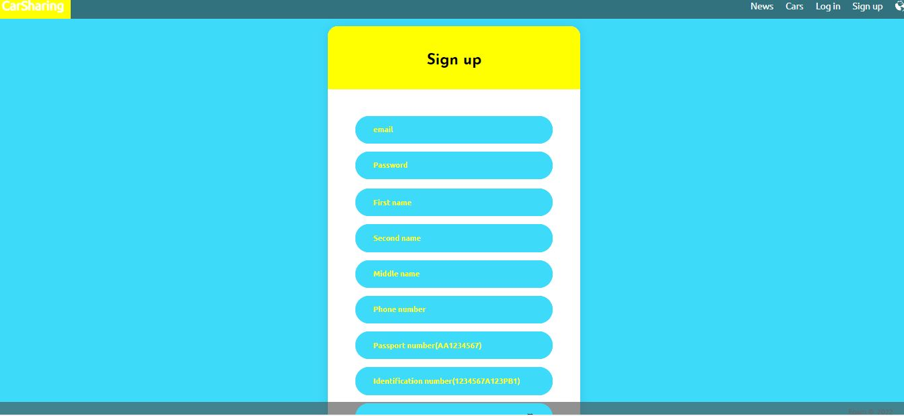

<h1>Carsharing</h1>

<h4>The customer selects a car from the list of available ones.
Fills out the order form, specifying passport details, rental period.
The customer pays for the order. 
The administrator registers the return of the car. In case of damage to the car, the administrator enters the information and issues an invoice for repairs.
The administrator can reject the application by specifying the reasons for refusal.</h4>

| Function                | Guest | User | Admin |
|-------------------------|-------|------|-------|
| Change language         | +     | +    | +     |
| See news                | +     | +    | +     |
| See cars                | +     | +    | +     |
| See comments            | +     | +    | +     |
| Login/Register          | +     | -    | -     |
| Logout                  | -     | +    | +     |
| Order car               | -     | +    | +     |
| See orders              | -     | +    | +     |
| See orders all users    | -     | -    | +     |
| Add/Edit news           | -     | -    | +     |
| Add/Edit cars           | -     | -    | +     |
| Approve/Decline payment | -     | -    | +     |

## Demo
### News page

### Register

### Login

### Car
Guest/User

Admin

### Order

### Orders list
User

Admin

### Payment

## Database diagram

Maksim Yukhnevich, 2022
